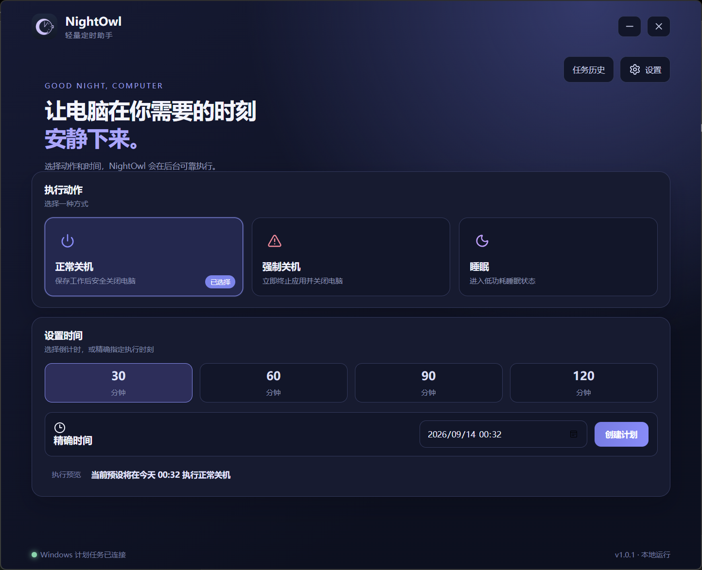
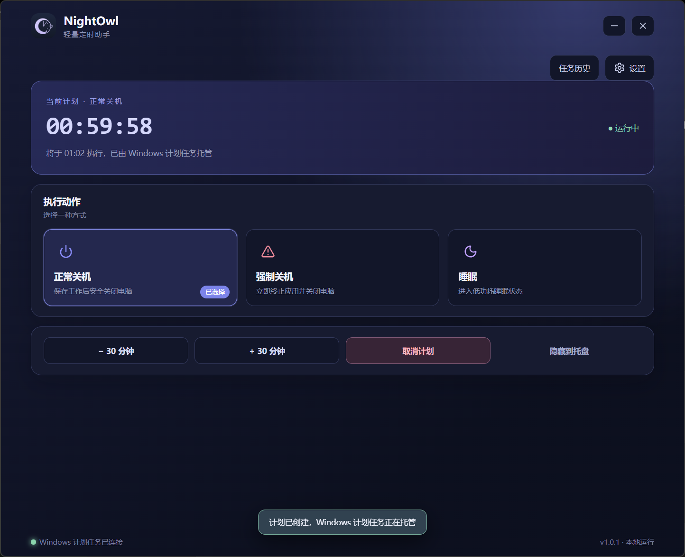
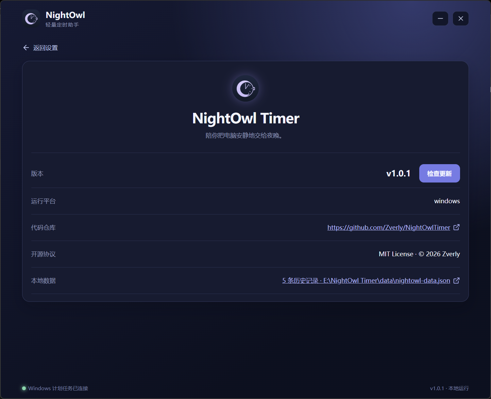

<div align="center">
  
  <h1>NightOwl Timer</h1>
  <p>轻量、可靠、界面精致的 Windows 定时关机与睡眠工具。</p>

[](https://github.com/Zverly/NightOwlTimer/actions/workflows/ci.yml)
[](https://github.com/Zverly/NightOwlTimer/releases/latest)
[](LICENSE)

</div>

## 界面预览

界面预览（来自 `1.0.1` 实际运行版本）：







## 下载

前往 [Releases](https://github.com/Zverly/NightOwlTimer/releases/latest) 下载最新的
`x64-setup.exe` 或 `.msi` 安装包。NightOwl 支持 Windows 10 和 Windows 11 x64。

安装包说明、升级流程和校验步骤见 [安装与发布说明](docs/INSTALLATION.md)。

> 当前安装包尚未购买代码签名证书。首次运行时 Windows SmartScreen 可能显示未知发布者提示，
> 可使用同一 Release 中的 `SHA256SUMS.txt` 校验安装包完整性。

## 功能

- 正常关机、强制关机和睡眠三种动作
- 30、60、90、120 分钟快捷预设与精确时间
- 倒计时增减 30 分钟、取消计划和隐藏到托盘
- 托盘状态、快速创建、调整、取消、设置与两种退出方式
- Windows 计划任务托管，主窗口关闭或程序退出后计划仍可执行
- 10 分钟、1 分钟和 30 秒本地提醒
- 任务历史、操作状态和诊断信息
- 单实例运行，再次启动时激活现有窗口
- 开机自启动、静默启动和关闭时隐藏到托盘
- 关于页面一键打开 GitHub 仓库、打开本地数据目录并检查新版本

## 数据与隐私

NightOwl 不需要账户，不收集遥测，也不会上传任务或操作记录。应用数据默认保存在应用目录下的 `data` 文件夹：

```text
data\nightowl-data.json
```

从旧版升级时，程序会在新位置没有数据的前提下自动迁移兼容数据。详细说明见
[PRIVACY.md](PRIVACY.md)。

关于页面中的“本地数据”会直接打开应用目录下的 `data` 文件夹，不依赖系统的 JSON
文件关联程序；“代码仓库”会使用系统默认浏览器打开 GitHub。

## 开发环境

- Node.js 20.19 或更高版本
- Rust stable MSVC 工具链
- Microsoft C++ Build Tools
- Microsoft Edge WebView2 Runtime

```powershell
npm ci
npm run tauri dev
```

完整验证：

```powershell
npm run format:check
npm run typecheck
npm run build
cargo clippy --manifest-path src-tauri/Cargo.toml --all-targets -- -D warnings
cargo test --manifest-path src-tauri/Cargo.toml
```

## 可选：自定义 Rust 工具链目录

如需将 Rust 工具链安装到自定义目录，可运行：

```powershell
$toolchainRoot = Read-Host '请输入 Rust 工具链目录'
.\setup-rust.ps1 -ToolchainRoot $toolchainRoot
$env:PATH = "$env:CARGO_HOME\bin;$env:PATH"
```

## 打包

```powershell
npm run tauri build -- --bundles nsis
```

安装包生成在 `src-tauri\target\release\bundle\nsis`。同时构建 NSIS 与 MSI 可运行：

```powershell
npm run tauri build -- --bundles nsis,msi
```

推送 `v*` 标签后，
GitHub Actions 会自动构建 Windows 安装包、生成 SHA-256 校验文件并创建 Release。

## 项目结构

```text
src/                    Vue 界面与样式
public/                 前端应用图标
src-tauri/src/          Rust 业务逻辑与 Windows 计划任务集成
src-tauri/icons/        Windows 应用、安装包和托盘图标
src-tauri/capabilities/ Tauri 权限配置
.github/workflows/      持续集成与自动发布
```

## 许可证

本项目使用 [MIT License](LICENSE)。
